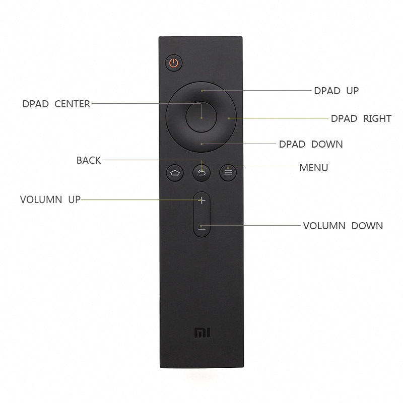
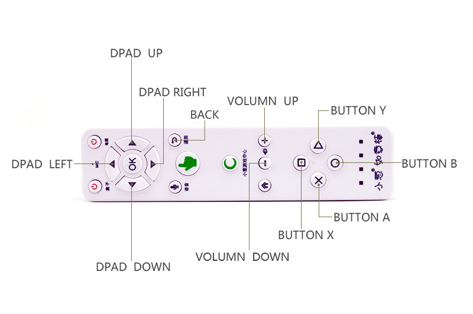
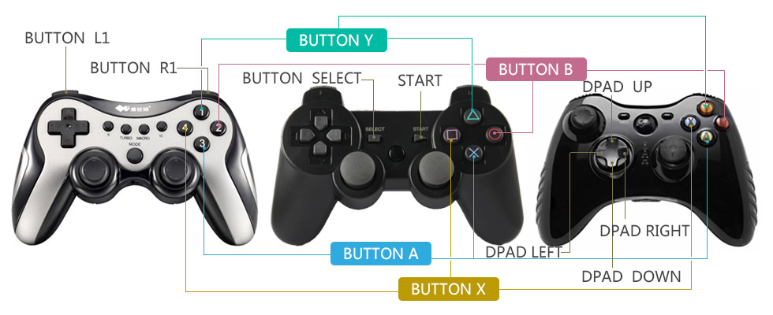

[toc]

## 1. Prefacce

### 1.1 电视游戏的操控设备

开发者在推出一款适配电视的游戏前需要考虑一个严峻的问题：用户手中有哪里设备——可以操控电视上的游戏？面对电视用户不可能再去触摸屏幕。只有通过远距离的控制器才能控制电视。我们认为这些控制器可以分为四类：

1. 首先是普通电视遥控器（Controller、Console）。这些遥控器上面有方向键、音量键、HOME键、返回键等按键。现在很多智能电视遥控器（如小米的、天猫的）只有这几个键。但传统上这些遥控器会有数字键、选台键等多得多的键。
2. 带鼠标功能的电视遥控器。比如小葱如意棒、Wii等。这类遥控器是Android游戏开发者的福音：传统针对手机设计的Android游戏多数靠触摸（和体感）控制；这类游戏能移植到带鼠标功能的电视上非常容易。因为多数触摸和点击操作（事件）可相互替代。
3. 游戏手柄（Gamepad）。从最早的家庭游戏机、PS、XBOX等设备的手柄，到为PC游戏设计的手柄等。这类手柄包含方向键（Dpad）、摇杆、YBAX键（1234键、△○×□键）、L1/R1键等。
4. 蓝牙/无线键鼠。几乎所有智能电视和盒子都是基于Android，而Android对传统PC键盘鼠标有很好的支持。如果家里有蓝牙/无线键盘鼠标，很多时候，用它们操控电视游戏很方便，且体验较好。

### 1.2 电视、盒子与操控设备的碎片化

PC游戏开发者一般只需要考虑键盘鼠标的操控。手机游戏开发者一般只需要考虑触摸、体验操控。这几种操控方式都是标准、一致的：不论用户使用哪个牌子的键盘、鼠标、手机，开发者都只需要处理同一套事件。

但用户手中的电视控制设备是不可预测的。多数用户只有电视遥控器。玩家用户有比较大的可能拥有游戏手柄。部分用户有带鼠标功能的遥控器等其他操控设备。这些设备的按键数量、键码都不一致。不仅如此，同一类设备，在不同的盒子上也可能表现不同。

现在市场上有很多游戏手柄厂商，他们生产的手柄在外观和协议（按键事件）上均有不同。例如，一些手柄具有YBAX键，另一些手柄在相同位置绘制的是“△○×□”，或者“1234”。同一位置的键被按下时，系统上报的键码有可能相同，也有可能不同。比如Y键，多数手柄报告`Button_Y`事件。但有的手柄报告`Y`事件或`Button_1`事件（“1234”手柄）。

即使相同位置的键，上报的键码也可能不同，如L1键，多数手柄会报告`Button_L1`事件，但少数手柄会报告`Button_5`事件（如北通部分手柄）。

除了手柄的差异，设备之间对按键事件的处理也有差异。盒子或电视使用的修改过的Android系统可能修改了底层的按键映射表。比如，一些盒子在B键被按下后，会上报`Button_B`事件。同时会上报`Back`事件（导致界面返回）或`Dpad_center`事件。这些情况在我们的测试研究中发生频繁。由于触发的第二个事件不是标准的，因此是难以预测的。

上述几类问题大幅增加了开发一款普遍适配的电视游戏的难度：

### 1.3 电视游戏：先谈能不能玩？

一个电视游戏到了用户手里，先不论体验如何，首先要先“能”玩。如果游戏只支持游戏手柄或鼠标，或只支持某种型号的游戏手柄，则从一开始就大大限定了用户群。

我们认为理想的情况应该是：

- 首先，对于一些简单的游戏（如坦克大战），用普通电视遥控器就能玩（按键数量足够），用游戏手柄、键盘应该能够玩。即这类游戏最好能支持所有设备。
- 其次，假如游戏复杂到只能通过游戏手柄或键盘玩，那么也要尽量做到不管用户手上有何种型号的手柄都能操纵游戏。

考虑前面列出的常见问题，我想各位开发者已经可以感受到：自己去做所有这些适配工作几乎是不可能完成的任务。需要耗费大量的财力（买各种设备、手柄）人力（做仔细的测试）。更重要的是，这种方式不能“适应未来”。即未来不断会有新设备出现，开发商只能一直维护一个团队，才能保证游戏在新设备下可玩。

## 2. 小葱操控SDK：标准化、云配置

小葱游戏团队是国内最早介入（Android）电视游戏行业的团队。我们不仅有理论，更有丰富的实践经验。经过几年的开发运营，我们掌握了电视游戏大量的规律、最佳实践、trouble-shooting；我们拥有丰富的适配经验。在此基础上，我们设计出一套解决电视游戏操控碎片化问题的方案。

该方案有两大核心：标准化和云配置。

标准化指的是，我们抛开各种设备的差异，提出一种能够尽量多的兼容设备的事件标准。SDK会对底层事件进行监听、过滤、转换。使得不论使用何种游戏手柄，游戏总能收到一套标准的事件。

没有一套万能的转换逻辑，因为怪异的设备层出不穷。针对特殊设备的配置是难免的。为此我们保持对市场关注，不断更新维护最新的设备配置，上传到云端。接入我们SDK的游戏可以从云端获取最新的配置。

## 3. 接入技术指南

> SDK目前只支持Android API 16+。

SDK的使用非常简单。它遵循Android标准的事件流，没有学习一套新按键事件标准的成本。对原有代码的侵入非常低。开发者甚至可以在不改动原有逻辑的情况下完成适配。

首先将SDK的jar包放入工程：将 **xc-control-sdk.jar**([下载](https://github.com/XiaoCongGame/sdk-control/blob/master/xc-control-sdk.jar)) 放入游戏工程的 **libs** 目录。

SDK的核心类是`tv.xiaocong.sdk.control.ControlManager`。这个类负责加载配置、过滤事件。这个类需要被实例化、初始化。初始化成功后，将通过`ControlManagerInitCallback`回调接口通知初始化成功，按键过滤、转换已就绪。

相比与其他操控类的SDK，**小葱操控SDK对代码的侵入是比较小的**。游戏核心代码（多数使用其他语言、游戏引擎编写）一般不需要改动。只需要改动最外层的Activity。因此集成是非常容易的。

下面通过Demo工程介绍SDK的使用。

1、参考 `tv.xiaocong.sdk.control.demo.SdkDemoActivity` 配置你的 Activity。

```java
	public class SdkDemoActivity extends Activity implements ControlManagerInitCallback {
		...
```

2、实例化`controlManager`：

```java
	private ControlManager controlManager = new ControlManager(this, this);
```

ControlManager的第一个参数是`Activity`，第二个参数是`ControlManagerInitCallback`接口实现：

	tv.xiaocong.sdk.control.ControlManager.ControlManager(Activity, ControlManagerInitCallback)

3、可以在一个合适的时机调用初始化方法，一般在`onCreate()`中：

```java
    @Override
    protected void onCreate(Bundle savedInstanceState) {
		...
        controlManager.init();
    }
```

4、实现`ControlManagerInitCallback`接口的`doneInitControlManager(success)`方法。方法只有一个参数，表示初始化是否成功。初始化失败最主要的原因是：未能加载到用户设备的配置文件。

`doneInitControlManager(success)`会在UI线程被调用。

```java
    @Override
    public void doneInitControlManager(boolean success) {
        if (success) {
            Toast.makeText(this, "加载手柄配置文件完成", Toast.LENGTH_SHORT).show();
        } else {
            Toast.makeText(this, "加载手柄配置文件失败！！", Toast.LENGTH_SHORT).show();
        }
    }
```

游戏开始时一般会有一个启动画面。游戏进行资源加载。可以将SDK的初始化算作启动加载项目之一。通过`doneInitControlManager(success)`方法监听加载完成事件，关闭启动屏，进入游戏。

5、重写`android.app.Activity.dispatchKeyEvent(KeyEvent)`方法。多数情况下，重写后的方法只需要做一件事：判断`controlManager.dispatchKeyEvent()`方法返回值是否为true，若为true，返回true（表示过滤掉此事件）；否则让事件放行：

```java
    @Override
    public boolean dispatchKeyEvent(KeyEvent event) {
        if (controlManager.dispatchKeyEvent(event, this)) {
            return true;
        } else {
            return super.dispatchKeyEvent(event);
        }
    }
```

## 4. 技术路径详解

前面介绍过，可以操控电视的设备差异化是非常大的，比如从大类上分电视遥控器、游戏手柄、键盘。虽说标准化有好处，把这些设备强制统一成一种，既不现实也会限制更高级设备的功能。因此我们将设备分类对待。

操控设备分三个类：电视遥控器、游戏手柄、键盘。同一类下的设备具有相同的按键标准。不同类的设备的按钮标准今可能做到超集、子集的关系。

### 4.1 电视遥控器

电视遥控器分两个亚类：Mini和Complex。

Mini指没有上下左右确定、菜单、返回、音量键的小遥控器。如小米的、天猫的。Complex指有更多的按键。

下图是Mini遥控器标准的按键事件。我们标准化的按键共有9个。其他按键，由于某些主要设备上不存在，故不做标准化处理。



|键        |事件         |
|----------|------------|
|向上       |DPAD_UP     |
|向下       |DPAD_DOWN   |
|向左       |DPAD_LEFT   |
|向右       |DPAD_RIGHT  |
|中心（确认）|DPAD_CENTER |
|菜单       |MENU        |
|返回       |BACK        |
|音量加     |VOLUMN_UP   |
|音量减     |VOLUMN_DOWN |

#### 4.1.1 小葱如意棒

小葱如意棒是小葱游戏专门推出的针对电视游戏和娱乐的操控设备。它具有鼠标、按键、体感功能。

玩游戏时，小葱如意棒一般是横握，按键映射如下图所示：



### 4.2 游戏手柄

游戏手柄看似差异大，但统一起来还是较容易的。



> L2/R2的支持没有L1/R1支持好。很多盒子上识别不出这两个键。

|键    |事件              | 
|------|------------------|
|向上  |DPAD_UP|
|向下  |DPAD_DOWN|
|向左  |DPAD_LEFT|
|向右  |DPAD_RIGHT|
|Y     |BUTTON_Y|
|B     |BUTTON_B|
|A     |BUTTON_A|
|X     |BUTTON_X|
|L1    |BUTTON_L1|
|R1    |BUTTON_R1|
|L2    |BUTTON_L2|
|R2    |BUTTON_R2|
|选择  |BUTTON_SELECT|
|开始  |BUTTON_START|

### 4.3 键盘

键盘事件还是很标准的。现阶段暂时不需要做什么标准化。
